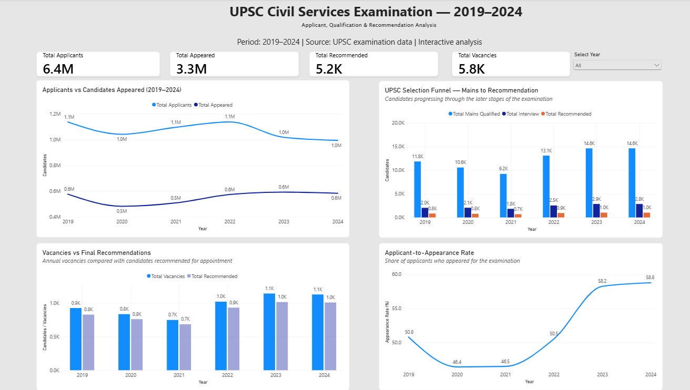

# UPSC Civil Services Examination — 2019–2024 Analysis

## Project Overview

This project analyzes the UPSC Civil Services Examination pipeline from 2019 to 2024, examining candidate participation, progression through different examination stages, vacancies, and final recommendations.

The analysis transforms examination data into meaningful analytical metrics and an interactive Power BI dashboard to identify trends, compare annual performance, and understand how candidates progress from application to final recommendation.

## Project Objective

The objective of this project is to:

* Analyze trends in applications and examination participation from 2019–2024.
* Measure candidate progression across Mains, Interview, and final recommendation stages.
* Calculate key performance and conversion rates.
* Compare annual vacancies with final recommendations.
* Identify meaningful changes in the examination pipeline over time.
* Present the findings through an interactive Power BI dashboard.

## Tools & Technologies

* **Microsoft Excel** — Data cleaning, exploratory analysis, calculations, and data preparation
* **Google BigQuery** — Data storage, querying, and data preparation
* **SQL** — Data exploration and analytical calculations
* **Microsoft Power BI** — Interactive dashboard development and visualization
* **DAX** — Creation of analytical measures and performance metrics
* **Microsoft PowerPoint** — Data storytelling, visualization of insights, and presentation of analytical findings

## Methodology

The project followed an end-to-end data analytics workflow:

1. **Data Preparation**
   UPSC examination data for 2019–2024 was organized into a structured dataset containing applications, appearances, Mains qualification, interviews, recommendations, and vacancies.

2. **Data Analysis**
   The dataset was analyzed using SQL and analytical calculations to understand candidate progression across the examination stages.

3. **Metric Development**
   DAX measures were created in Power BI to calculate key metrics including:

   * Total Applicants
   * Total Candidates Appeared
   * Total Mains Qualified
   * Total Interview Candidates
   * Total Recommended Candidates
   * Total Vacancies
   * Appearance Rate
   * Mains Qualification Rate
   * Recommendation Rate

4. **Dashboard Development**
   An interactive Power BI dashboard was developed to visualize annual trends and compare candidate progression, vacancies, and recommendations.

5. **Insight Generation**
   The final analysis focuses on identifying changes in participation, candidate progression, and recommendation patterns across the 2019–2024 period.

## Key Analytical Findings

The analysis of the 2019–2024 UPSC Civil Services Examination data highlights several important trends:

* **Candidate participation increased:** The appearance rate increased from **50.8% in 2019 to 58.8% in 2024**, indicating a higher share of applicants appearing for the examination.

* **Mains qualification improved:** The Mains qualification rate increased from **2.05% to 2.51%** of candidates who appeared.

* **The Mains-qualified pool expanded:** Candidates qualifying for Mains increased from **11,845 in 2019 to 14,627 in 2024**, an increase of approximately **23.5%**.

* **Interview-stage participation increased:** Interview candidates increased from **2,034 to 2,845**, approximately **39.9%**.

* **Final recommendations increased:** Recommended candidates increased from **829 in 2019 to 1,009 in 2024**, approximately **21.7%**.

* **Recommendation rate declined:** Despite the increase in absolute recommendations, the recommendation rate among candidates who appeared declined from **40.76% in 2019 to 35.47% in 2024**.

* **Vacancies increased:** The number of vacancies was higher in 2024 than in 2019, while the dashboard enables annual comparison between vacancies and final recommendations.

### Overall Observation

The data shows that the examination pipeline changed across multiple stages between 2019 and 2024. Participation and the size of the later-stage candidate pools increased, while the proportion of appearing candidates who ultimately received recommendations declined.

These findings describe observed patterns in the dataset and do not establish causal relationships between the different factors.

## Power BI Dashboard

The interactive Power BI dashboard provides a consolidated view of the UPSC Civil Services Examination from 2019–2024.

### Dashboard Components

* **KPI Cards** — Total Applicants, Candidates Appeared, Recommended Candidates, and Vacancies
* **Applicants vs Candidates Appeared** — Annual participation trend
* **Selection Funnel** — Mains-qualified, interview, and recommended candidates
* **Vacancies vs Final Recommendations** — Annual comparison of vacancies and recommendations
* **Applicant-to-Appearance Rate** — Year-wise participation rate
* **Year Filter** — Interactive filtering for individual examination years

The dashboard is designed to help users quickly identify changes in participation, candidate progression, and final recommendations across the six-year period.

## Limitations

* The analysis covers only the **2019–2024** examination period.
* The dataset focuses on aggregate annual examination figures and does not contain individual candidate-level information.
* The analysis identifies trends and relationships in the available data but does not establish causal explanations.
* Some dashboard values are displayed using rounded units such as thousands or millions for readability.
* The Recommendation vs Vacancy comparison should be interpreted as a descriptive ratio rather than a direct measure of individual candidate selection probability.

## Project Structure
UPSC-CSE-2019-2024-Analysis/
│
├── README.md
├── UPSC_CSE_2019_2024_Full_Dataset.xlsx
├── UPSC_2019_2024_SQL_Analysis.sql
├── UPSC_Civil_Services_Analysis_2019_2024.pbix
├── UPSC_2019_2024_PowerBI_Dashboard.png
└── UPSC_Civil_Services_Analysis_2019_2024_Presentation_Final.pptx

## Business Analytics Value

This project demonstrates the ability to take structured data through an end-to-end analytics workflow and convert it into actionable insights.

Key capabilities demonstrated include:

* Data preparation and validation
* SQL-based data analysis
* KPI and metric development
* Trend and comparative analysis
* Data visualization
* Interactive dashboard development
* Analytical storytelling
* Communicating findings to a non-technical audience

The project combines technical analytics skills with business-oriented interpretation, making it relevant to **Business Analyst, Business Analytics, and Data Analyst** roles.

